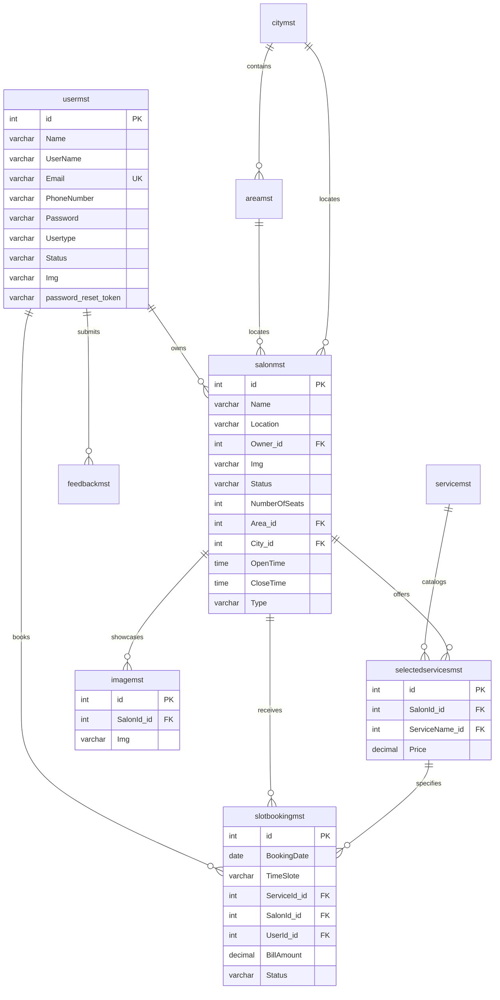

# Hair Harmony — Complete All-Phases Implementation Guide
## Migration: Django + MySQL → Node.js (Express) + React.js (Vite) + MySQL

---

## 1. Executive Summary

**Hair Harmony** is a comprehensive full-stack salon discovery and appointment scheduling platform migrated from a legacy Python/Django monolithic architecture to a modern, decoupled **MERN-like stack (MySQL, Express.js, React.js, Node.js)**. 

The application serves three distinct user roles:
1. **Customer / User**: Discovers local salons, explores offered services, checks real-time available 1-hour time slots, books appointments, tracks booking status, cancels appointments with strict 3-hour policy enforcement, and manages account profile and credentials.
2. **Salon Owner**: Registers salon details, manages station capacity, configures service offerings and custom prices, uploads studio gallery imagery, reviews customer appointment requests with single-click Accept / Reject (with reason) actions, and triggers automated transactional emails.
3. **Administrator**: Oversees the entire ecosystem, approves or rejects owner salon registrations, manages geographical masters (Cities & Areas), maintains global Service catalogs, reviews active and registered users, audits global bookings, and manages administrator credentials.

---

## 2. Default Access Credentials & Roles

| Role | Email | Password | Role Option | Target Dashboard | Permissions |
|------|-------|----------|-------------|------------------|-------------|
| **Administrator** | `admin@gmail.com` | `Admin` | `Admin` | `/admin/dashboard` | Master CRUD (Cities, Areas, Services), Salon approvals, User mgmt, Booking audit |
| **Salon Owner** | `rajesh@example.com` | `Password@123` | `Salon Owner` | `/owner/dashboard` | Salon details, station capacity, services & pricing, gallery upload, booking accept/reject |
| **Customer / User** | `het@example.com` | `Password@123` | `Customer` | `/user/profile` | Browse salons, filter by area, book 1-hour slot, view bookings, 3-hr cancellation, edit profile |

> [!TIP]
> **Admin Login Steps:**
> 1. Navigate to: `http://localhost:5173/login`
> 2. Select **"Admin"** on the role toggle button or leave default.
> 3. Enter Email: `admin@gmail.com`
> 4. Enter Password: `Admin`
> 5. Click **"Log In"** to be redirected to the Administrator Dashboard.

---

## 3. Technology Stack & Architectural Architecture

### 3.1 Backend Architecture
- **Runtime**: Node.js (v18+)
- **Framework**: Express.js
- **Database**: MySQL 8.x with `mysql2/promise` connection pooling
- **Authentication**: Stateless JSON Web Tokens (`jsonwebtoken`) + Salted bcrypt password hashing (`bcryptjs`)
- **File Storage**: Multer disk storage engine (`uploads/`) with public static route `/uploads`
- **Mailing Engine**: Nodemailer with SMTP transport for welcome emails, appointment confirmations/rejections, and password reset tokens
- **Security & Middleware**: Role-based access control (`verifyToken`, `requireUser`, `requireOwner`, `requireAdmin`), CORS headers, global error handlers

### 3.2 Frontend Architecture
- **Framework**: React 19 with Vite bundler
- **Styling**: Tailored Dark Luxury aesthetic with CSS Variables (`#0F1015`, `#181920`, `#22232D`, Gold `#daa520`, `#10B981`, `#EF4444`)
- **Routing**: React Router DOM (v6+) with Protected Route wraps (`<ProtectedRoute role="...">`)
- **State Management**: Centralized React Context (`AuthContext`) handling token persistence, decoded user payload, and synchronized role logout
- **HTTP Client**: Axios instance (`services/api.js`) with automatic JWT authorization header injection interceptors

---

## 4. Database Schema Overview

The database preserves 100% schema parity with the original Django database while introducing critical foreign keys and performance indexes:



---

## 5. Phase-by-Phase Implementation Details

### Phase 1: Project Setup & Database
- **Objective**: Establish project workspace, initialize Git, configure environment variables, and create MySQL database tables with exact Django field compatibility.
- **Key Files Created**:
  - `backend/config/db.js`: Connection pool with auto-reconnection and query promise support.
  - `backend/.env`: Configured `PORT=5000`, `DB_HOST=localhost`, `DB_USER=root`, `DB_NAME=hairharmony`, `JWT_SECRET`.
  - `.gitignore`: Configured to exclude `node_modules`, `uploads/` contents, and environment keys.
- **Verification**: `testConnection()` successfully initializes pool and verifies table connectivity on startup.

---

### Phase 2: Backend – Authentication & Admin Core APIs
- **Objective**: Implement JWT authentication, password hashing, and Admin management of City, Area, Service masters and Salon approval requests.
- **Key Modules**:
  - `authController.js`: `/api/auth/register`, `/api/auth/login`, `/api/auth/forgot-password`, `/api/auth/reset-password`, `/api/auth/change-password`.
  - `adminController.js`: `/api/admin/dashboard`, `/api/admin/salons/:id/approve`, `/api/admin/salons/:id/reject`, `/api/admin/cities`, `/api/admin/areas`, `/api/admin/services`, `/api/admin/users`, `/api/admin/bookings`.
  - `authMiddleware.js`: Token validation and strict role guards (`requireAdmin`, `requireOwner`, `requireUser`).
- **Verification**: Automated test script `backend/scripts/testPhase2.js` covering Admin Login, Master CRUD, and User registration.

---

### Phase 3: Backend – Owner & Booking APIs
- **Objective**: Implement Salon Owner management endpoints, service pricing, photo gallery uploads, dynamic 1-hour slot generation, customer booking creation, status management, and cancellation logic.
- **Key Modules**:
  - `salonController.js`: `getSalons`, `getAreas`, `getSalonById`, `getSalonSlots` (1-hour slot generator based on `OpenTime` and `CloseTime`).
  - `ownerController.js`: `getProfile`, `registerSalon`, `updateSalon`, `addService`, `deleteService`, `uploadImages`, `deleteImage`.
  - `bookingController.js`: `createBooking`, `getUserBookings`, `cancelBooking` (with 3-hour cutoff rule enforcement), `updateBookingStatus`.
- **Verification**: Automated test script `backend/scripts/testPhase3.js` verifying owner salon profile, slots generation, bookings creation, and status workflow.

---

### Phase 4: Frontend – Public Pages & Authentication
- **Objective**: Build client-facing landing page, public salon discovery cards, and full authentication pages with input validation and feedback.
- **Key Pages**:
  - `LandingPage.jsx`: Dynamic Hero section, Live Salon grid from `GET /api/salons`, Customer reviews, and Call-to-Action banners.
  - `LoginPage.jsx`: Role selector (Customer, Salon Owner, Administrator) with automated redirection to appropriate dashboard upon login.
  - `RegisterPage.jsx`: Dual customer/owner registration with 10-digit phone verification, password regex validation, and avatar upload.
  - `ForgotPasswordPage.jsx` & `ResetPasswordPage.jsx`: End-to-end token-based password recovery flow.
  - `AboutPage.jsx` & `ContactPage.jsx`: Information and support inquiries.
- **Verification**: Smooth cross-role logins and registrations verified in Chrome.

---

### Phase 5: Frontend – User Dashboard
- **Objective**: Build dedicated customer dashboard featuring area filters, salon profile inspection, dynamic booking calendar/slot selector, cancellation management, and profile editing.
- **Key Pages**:
  - `UserProfilePage.jsx`: Area filter buttons, keyword search bar, and `<SalonCard />` grid.
  - `SalonDetailsPage.jsx`: Salon banner, operational hours, station count, owner contact, services pricing table, and interactive photo gallery lightbox.
  - `BookingPage.jsx`: Date picker, dynamic 1-hour slot dropdown, multi-service checkbox selection with live bill computation, and reservation submission.
  - `BookingHistoryPage.jsx`: Tabular view of appointments with status badges (Pending, Accepted, Rejected, Completed), and modal cancellation with 3-hour rule notice.
  - `EditProfilePage.jsx`: Pre-filled customer profile details (Name, Username, Email, Phone, Avatar) with `PUT /api/user/profile` multipart support.
  - `ChangePasswordPage.jsx`: Old password verification, new password confirmation, and regex compliance check.
- **Verification**: Complete automated test script `backend/scripts/testPhase5.js` with 12/12 passing test assertions and clean Vite production build.

---

### Phase 6: Frontend – Owner Dashboard
- **Objective**: Provide salon owners with full management over their salon details, services list, gallery photos, and customer appointments.
- **Key Pages**:
  - `OwnerDashboardPage.jsx`: Salon overview card, opening hours, capacity, and appointment management panel (Accept / Reject with reason).
  - `RegisterSalonPage.jsx`: Multi-field salon registration form for newly registered owners with `needsSalon: true`.
  - `EditSalonPage.jsx`: Modify salon name, location, area, city, opening/closing hours, and seating capacity.
  - `ManageServicesPage.jsx`: Add services from global catalog with customized salon price, and delete services.
  - `UploadImagesPage.jsx`: Upload up to 5 salon studio gallery photos with instant preview and deletion.

---

### Phase 7: Frontend – Admin Dashboard
- **Objective**: Central administration dashboard for platform governance and master record management.
- **Key Pages**:
  - `AdminDashboardPage.jsx`: Platform overview metrics (total salons, owners, customers, appointments) and pending salon approval queue.
  - `ManageCitiesPage.jsx`: Add, edit, and delete cities.
  - `ManageAreasPage.jsx`: Add, edit, and delete areas associated with cities.
  - `ManageServicesPage.jsx`: Global service master catalog management.
  - `ManageUsersPage.jsx`: View and filter registered owners and customers with account status controls.
  - `AdminBookingsPage.jsx`: Global audit log of all system appointments.
  - `AdminSettingsPage.jsx` & `AdminChangePasswordPage.jsx`: Administrative preferences and credentials.

---

### Phase 8: Email & File Upload Integration
- **Objective**: Integrate transactional email alerts and robust image upload pipelines.
- **Implementation**:
  - `email.js`: Configured Nodemailer transporter with HTML email templates:
    - Welcome email on registration.
    - Password reset link with unique crypto token.
    - Password change confirmation alert.
    - Appointment Acceptance notification to customer.
    - Appointment Rejection notification with reason.
  - `upload.js`: Multer storage with timestamp prefixing, MIME type verification (JPEG, PNG, WEBP), and 10MB limits.
  - Static file hosting via `app.use('/uploads', express.static(...))` and frontend `imageUrl.js` helper.

---

### Phase 9: Polish, Validation & Testing
- **Objective**: Harden security, sanitize database inputs, enforce boundary conditions, and provide user feedback.
- **Key Rules Enforced**:
  - **3-Hour Cancellation Rule**: `parseAppointmentDateTime` parses slot time (e.g. `09:00 AM - 10:00 AM`) and verifies `diffMs >= 3 * 60 * 60 * 1000`.
  - **Phone Number Validation**: Strictly 10 digits (`/^\d{10}$/`).
  - **Strong Password Policy**: 8+ characters with uppercase, lowercase, digit, and special character.
  - **String Length Limits**: Form inputs constrained with `maxLength={20}` for MySQL `varchar(20)` columns.
  - **Role-Based Guards**: Unauthorized routes immediately redirect users to their appropriate dashboard.

---

### Phase 10: Final Review & Verification
- **Objective**: Production readiness, build verification, and automated regression testing.
- **Test Suites**:
  1. `node scripts/testPhase2.js` → Phase 2 Auth & Admin APIs (PASSED)
  2. `node scripts/testPhase3.js` → Phase 3 Owner & Booking APIs (PASSED)
  3. `node scripts/testPhase5.js` → Phase 5 User Dashboard & Bookings (12/12 PASSED)
  4. `npm run build` (frontend) → Clean build in 1.41s with zero errors.

---

## 6. Comprehensive API Reference

| Method | Endpoint | Access | Purpose |
|--------|----------|--------|---------|
| `POST` | `/api/auth/register` | Public | Register Customer or Salon Owner |
| `POST` | `/api/auth/login` | Public | Authenticate user and receive JWT |
| `POST` | `/api/auth/forgot-password` | Public | Request password reset token via email |
| `POST` | `/api/auth/reset-password/:token`| Public | Reset password with token |
| `POST` | `/api/auth/change-password` | Protected (Any) | Change password using current credentials |
| `GET` | `/api/salons` | Public | List all active salons with optional `?area=id` |
| `GET` | `/api/salons/areas` or `/api/areas`| Public | List all areas for dropdown filter |
| `GET` | `/api/salons/:id` | Public | Get salon details, services, and gallery images |
| `GET` | `/api/salons/:id/slots` | Public | Generate 1-hour slots for salon operational hours |
| `GET` | `/api/user/profile` | Protected (User)| Get current customer profile |
| `PUT` | `/api/user/profile` | Protected (User)| Update customer profile & avatar |
| `GET` | `/api/user/bookings` | Protected (User)| Fetch customer booking history |
| `POST` | `/api/bookings` | Protected (User)| Place new appointment booking |
| `PATCH`| `/api/bookings/:id/cancel` | Protected (User)| Cancel pending booking (3-hr rule enforced) |
| `GET` | `/api/owner/profile` | Protected (Owner)| Get owner salon details and appointments |
| `POST` | `/api/owner/salon` | Protected (Owner)| Register new salon with initial details |
| `PUT` | `/api/owner/salon/:id` | Protected (Owner)| Update salon hours and capacity |
| `POST` | `/api/owner/services` | Protected (Owner)| Add service and price to salon menu |
| `DELETE`| `/api/owner/services/:id` | Protected (Owner)| Remove service from salon menu |
| `POST` | `/api/owner/images` | Protected (Owner)| Upload salon gallery photos |
| `DELETE`| `/api/owner/images/:id` | Protected (Owner)| Delete salon gallery photo |
| `PATCH`| `/api/bookings/:id/status` | Protected (Owner)| Accept or reject customer booking |
| `GET` | `/api/admin/dashboard` | Protected (Admin)| Get system statistics and pending salons |
| `PATCH`| `/api/admin/salons/:id/approve` | Protected (Admin)| Approve pending owner salon |
| `PATCH`| `/api/admin/salons/:id/reject` | Protected (Admin)| Reject pending owner salon |
| `GET` / `POST` | `/api/admin/cities` | Protected (Admin)| List and create cities |
| `PUT` / `DELETE`| `/api/admin/cities/:id` | Protected (Admin)| Update and delete cities |
| `GET` / `POST` | `/api/admin/areas` | Protected (Admin)| List and create areas |
| `PUT` / `DELETE`| `/api/admin/areas/:id` | Protected (Admin)| Update and delete areas |
| `GET` / `POST` | `/api/admin/services` | Protected (Admin)| List and create global services |
| `DELETE`| `/api/admin/services/:id` | Protected (Admin)| Delete global service |
| `GET` | `/api/admin/users` | Protected (Admin)| List registered users by role |
| `GET` | `/api/admin/bookings` | Protected (Admin)| Audit log of all bookings |

---

## 7. Frontend Routes & Component Mapping

| Route URL | Component | Access Guard | Description |
|-----------|-----------|--------------|-------------|
| `/` | `LandingPage` | Public | Homepage showcasing live salons and features |
| `/login` | `LoginPage` | Public | Multi-role login with role redirection |
| `/register` | `RegisterPage` | Public | Customer & Owner registration form |
| `/forgot-password` | `ForgotPasswordPage` | Public | Email password recovery form |
| `/reset-password/:token`| `ResetPasswordPage` | Public | Set new password with email token |
| `/about` | `AboutPage` | Public | About Hair Harmony platform |
| `/contact` | `ContactPage` | Public | Contact & support form |
| `/salon/:id` | `SalonDetailsPage` | Public / User | Full salon profile, services, and photo gallery |
| `/salon/:id/book` | `BookingPage` | Protected (`user`) | Date picker, slot selector, multi-service cart |
| `/user/profile` | `UserProfilePage` | Protected (`user`) | Customer dashboard with area filters & salon grid |
| `/user/bookings` | `BookingHistoryPage` | Protected (`user`) | Appointment records with 3-hr cancellation modal |
| `/user/edit-profile` | `EditProfilePage` | Protected (`user`) | Update name, username, email, phone, avatar |
| `/user/change-password`| `ChangePasswordPage`| Protected (`user`) | Update account password |
| `/owner/dashboard` | `OwnerDashboardPage` | Protected (`owner`)| Owner dashboard, salon overview, booking approvals |
| `/owner/register-salon`| `RegisterSalonPage` | Protected (`owner`)| New salon onboarding form |
| `/owner/edit-salon` | `EditSalonPage` | Protected (`owner`)| Edit salon details, hours, capacity |
| `/owner/services` | `ManageServicesPage` | Protected (`owner`)| Add and manage salon services & prices |
| `/owner/images` | `UploadImagesPage` | Protected (`owner`)| Upload and manage studio photos |
| `/admin/dashboard` | `AdminDashboardPage` | Protected (`admin`)| Metrics cards & pending salon approvals |
| `/admin/cities` | `ManageCitiesPage` | Protected (`admin`)| City master record CRUD |
| `/admin/areas` | `ManageAreasPage` | Protected (`admin`)| Area master record CRUD |
| `/admin/services` | `ManageServicesPage` | Protected (`admin`)| Global services master catalog |
| `/admin/users` | `ManageUsersPage` | Protected (`admin`)| Manage registered owners and users |
| `/admin/bookings` | `AdminBookingsPage` | Protected (`admin`)| Global appointments audit log |
| `/admin/settings` | `AdminSettingsPage` | Protected (`admin`)| System configuration preferences |
| `/admin/change-password`| `AdminChangePasswordPage`| Protected (`admin`)| Administrator password update |

---

## 8. How to Run & Verify the Project

### Step 1: Start Backend Server
```bash
cd backend
npm install
npm run dev
# Server listens on http://localhost:5000
```

### Step 2: Start Frontend Application
```bash
cd frontend
npm install
npm run dev
# Client is accessible on http://localhost:5173
```

### Step 3: Run Automated Backend Test Suites
```bash
cd backend
node scripts/testPhase2.js  # Tests Auth, Admin & Masters
node scripts/testPhase3.js  # Tests Owner & Booking APIs
node scripts/testPhase5.js  # Tests User Dashboard, Slots & 3-Hour Cancellation
```

### Step 4: Run Frontend Production Build Check
```bash
cd frontend
npm run build
```
All tests should pass with 100% success and zero build warnings or errors.

